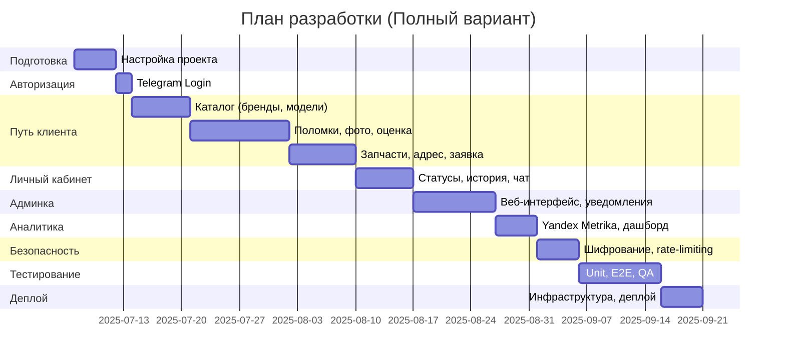
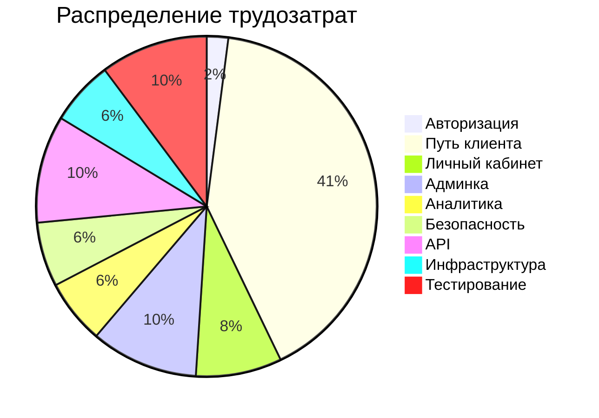

# План разработки модуля “Ремонт” для Telegram WebApp (Полный вариант)

## Общая информация

- **Название проекта**: Q — Telegram WebApp для ремонта мобильных устройств
- **Модуль**: Ремонт
- **Целевая аудитория**: 18–45 лет, Москва, пользователи смартфонов
- **Платформа**: Telegram WebApp, адаптивный дизайн
- **Цель**: Полная реализация всех функций согласно ТЗ, включая аналитику, ML, веб-админку и масштабируемость.

## Технологический стек

- **Фронтенд**: Vue 3, TypeScript, Telegram WebApp SDK, Tailwind CSS
- **Бэкенд**: Node.js (NestJS), Telegram Bot API
- **База данных**: PostgreSQL
- **Хранилище**: AWS S3 (для фото)
- **Интеграции**: Yandex Maps API, ML API (AWS Rekognition/Google Vision), Yandex Metrika
- **Безопасность**: HTTPS, AES (фото), rate-limiting, reCAPTCHA v3
- **Инфраструктура**: DigitalOcean/AWS, CI/CD (GitHub Actions)

## Оценка трудозатрат

Оценка дана для одного senior full-stack разработчика (8 часов/день).

| Модуль | Задачи | Оценка (часы) |
| --- | --- | --- |
| Авторизация | Telegram Login, сохранение данных | 8–12 |
| Путь клиента |  |  |
| \- Выбор бренда | Список, поиск, JSON/БД | 14–18 |
| \- Выбор модели | Список, ручной ввод, каталог | 20–26 |
| \- Выбор поломки | Список, ручной ввод | 10–14 |
| \- Загрузка фото | Интерфейс, S3, ML API | 30–40 |
| \- Предварительная оценка | Прайс (JSON/БД), ML | 24–34 |
| \- Выбор запчастей | Оригинал/копия, пересчет | 8–12 |
| \- Время и адрес | Yandex Maps, слоты | 20–30 |
| \- Подтверждение заявки | Резюме, отправка | 10–14 |
| \- После отправки | Статус, переход в ЛК | 6–10 |
| Личный кабинет | Статусы, история, чат | 35–45 |
| Админка | Веб-интерфейс, авторизация, уведомления | 40–60 |
| Аналитика | Yandex Metrika, кастомный дашборд | 25–35 |
| Безопасность | Шифрование, rate-limiting, reCAPTCHA | 25–35 |
| API | Каталог, прайс, заявки | 40–60 |
| Инфраструктура | Сервер, CI/CD, деплой | 25–35 |
| Тестирование | Unit (Vitest), E2E (Playwright), QA | 40–60 |
| **Итого** |  | **430–588 часов** |

## Сроки

- **Рабочие дни**: 54–74 дня (\~2.5–3.5 месяца)
- **С учетом выходных**: 3–4 месяца
- **Тестирование (отдельно)**: 40–60 часов (\~5–7.5 дней)

## Временная шкала (Gantt chart)

## Распределение трудозатрат (Pie chart)

## Риски

- Подбор ML API может занять дополнительное время.
- Отсутствие точных данных для каталога.
- Ограничения Telegram WebApp (производительность, размер бандла).
- Баги в интеграциях (Yandex Maps, Telegram Bot API).

## Рекомендации

- Начать с каталога (10 брендов, 50 моделей).
- Использовать Vuetify для UI.
- Настроить Sentry для мониторинга.
- Тестировать на реальных устройствах (iOS, Android).
- После релиза добавить: оплату (ЮKassa), расширенную аналитику.
