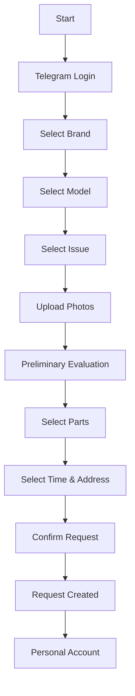
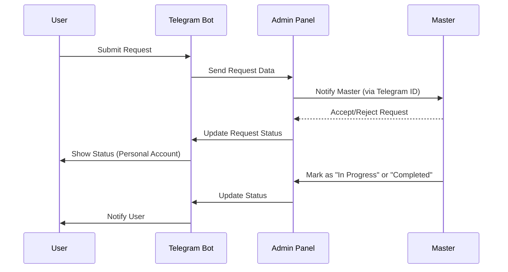
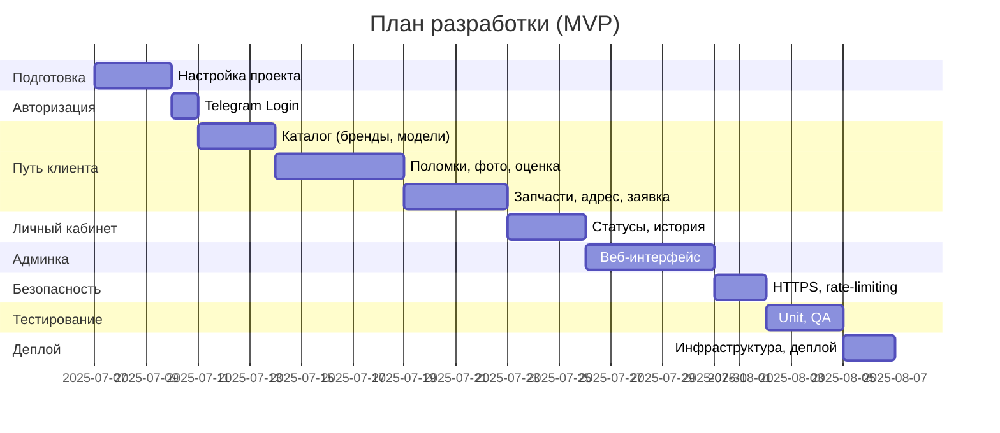
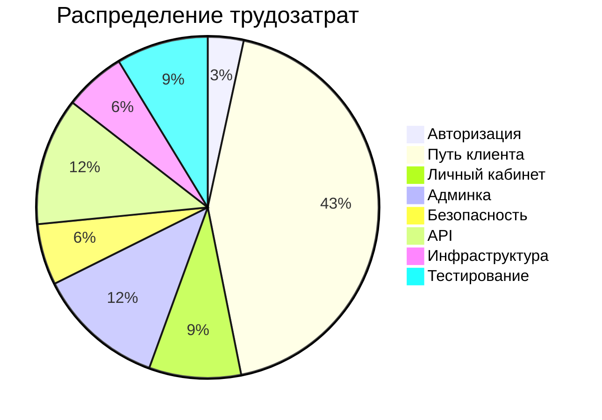
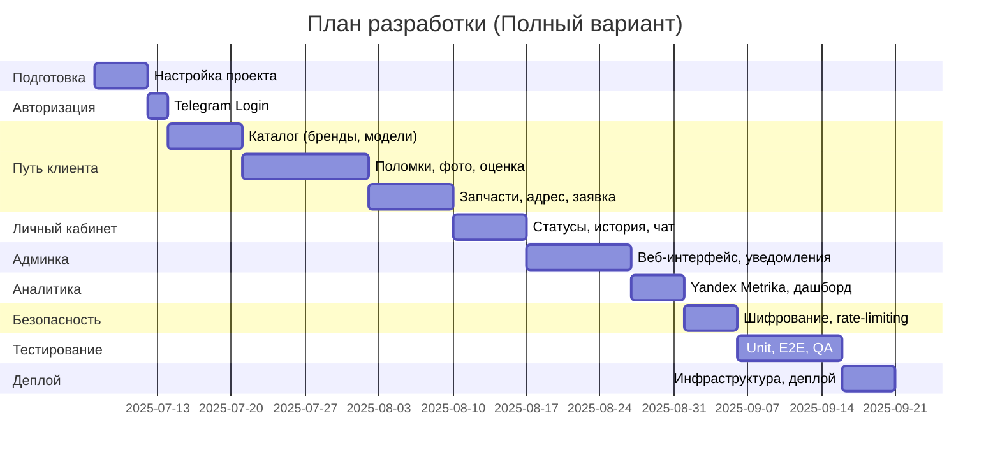
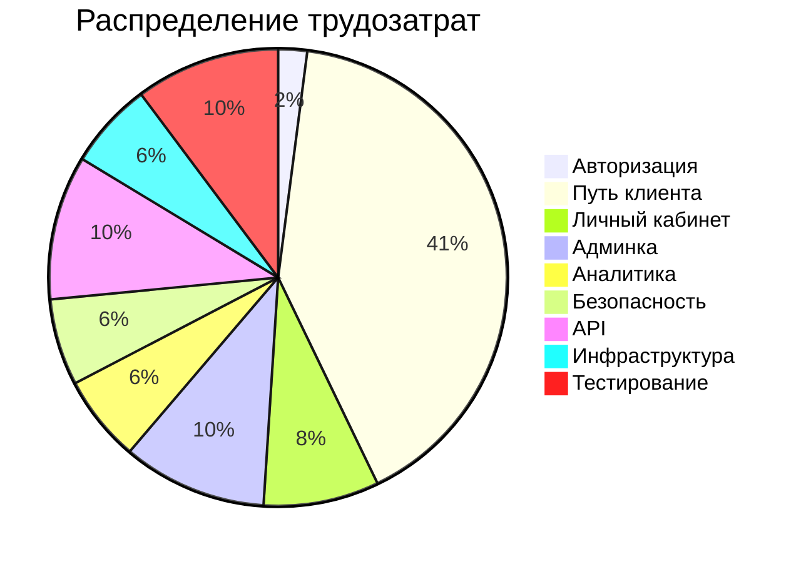

# Техническое задание (ТЗ) на разработку модуля “Ремонт” для Telegram WebApp Q

## 1. Общая информация
- **Название проекта**: Q — Telegram WebApp для ремонта мобильных устройств
- **Модуль**: Ремонт
- **Целевая аудитория**: 18–45 лет, проживают в Москве, используют смартфоны, ценят удобство, скорость и доверие
- **Устройства**: Все бренды, все модели
- **Платформа**: Telegram WebApp (бот), адаптивный дизайн

## 2. Авторизация
- **Метод**: Telegram Login
- **Сценарий**:
  - Пользователь нажимает кнопку “Начать”.
  - Авторизация через Telegram с получением данных: `user_id`, `username`, `first_name`, `photo_url`.
  - После успешной авторизации — переход к выбору устройства.

## 3. Путь клиента (основной)

### Диаграмма пути клиента

### 3.1. Выбор бренда
- Отображение популярных брендов (Apple, Samsung, Xiaomi и др.).
- Поиск по названию бренда.
- Возможность выбрать вариант “Другое”.

### 3.2. Выбор модели
- Данные моделей предоставляются через API или статичный каталог.
- Возможность ручного ввода модели.

### 3.3. Выбор поломки
- Варианты поломок: экран, батарея, камера, не включается, вода и т.д.
- Кнопка “Указать вручную” для ввода текстовой информации.

### 3.4. Загрузка фото (опционально)
- Инструкция: “Сделайте чёткое фото повреждения”.
- Загрузка 1–5 фотографий.
- Фото обрабатываются ИИ для первичной оценки.

### 3.5. Предварительная оценка
- **Алгоритм оценки**:
  - При наличии API с сайтом — динамическая цена.
  - При отсутствии API — статичный прайс (JSON или таблица).
  - Если загружены фото — подключение ML/ИИ для анализа.
- **Отображение для клиента**:
  - Тип поломки.
  - Стоимость ремонта (диапазон: от / до).
  - Тип запчастей: оригинал / копия.
  - Время ремонта.

### 3.6. Выбор запчастей
- Кнопка выбора: оригинал / копия.
- Отображение итоговой цены с учетом выбранной детали.

### 3.7. Выбор времени и адреса
- **Варианты**:
  - Курьер: ввод адреса (интеграция с картами), выбор даты и временного слота, отображение: “Курьер приедет завтра в 15:00–17:00”.
  - Самостоятельно: показ адреса ремонтной точки и графика работы.

### 3.8. Оплата (опционально)
- Возможность внести предоплату за запчасть.
- Способы оплаты: ЮKassa / CloudPayments (по желанию).

### 3.9. Подтверждение заявки
- **Резюме**:
  - Устройство, поломка, цена, дата, мастер.
- Кнопка: “Подтвердить заявку”.

### 3.10. После отправки
- Статус: “Заявка создана”.
- Переход в личный кабинет.

## 4. Личный кабинет пользователя
- **Статусы ремонта** (поэтапно):
  - Курьер едет.
  - Устройство принято.
  - В работе.
  - Готово.
- Чат с мастером.
- Возможность повторить заявку.
- История ремонтов.
- Кнопка “Позвонить в поддержку” (номер телефона).

## 5. Распределение заявок

### Диаграмма взаимодействия (распределение заявок)

- Админка для распределения заявок между мастерами.
- У каждого мастера есть Telegram ID.
- Заявки поступают мастеру через бота.
- **Действия мастера**:
  - Принять / отказаться от заявки.
  - Отметить статус: “Принял в работу” / “Завершено”.
- **Отображение для заказчика**:
  - Фото мастера, имя, рейтинг.

## 6. Метрики и аналитика

### 6.1. Клиентская часть
- Количество заходов в бот.
- Количество авторизаций.
- Досмотр до каждого шага (бренд, модель, поломка, оценка, оплата).
- Конверсия в заявку.

### 6.2. Админская часть
- Количество заявок по дням и мастерам.
- Средняя цена ремонта.
- Среднее время выполнения.
- Количество повторных клиентов.

## 7. Безопасность
- Все данные привязаны к Telegram ID.
- Фото шифруются или обрезаются до метаинформации.
- Защита от флуда.
- Модуль логирования.

## 8. Возможности масштабирования
- Легкое добавление новых мастеров.
- Подключение новых городов.
- API-интеграция с сайтом и CRM.

# План разработки модуля “Ремонт” для Telegram WebApp (MVP)

## Общая информация
- **Название проекта**: Q — Telegram WebApp для ремонта мобильных устройств
- **Модуль**: Ремонт
- **Целевая аудитория**: 18–45 лет, Москва, пользователи смартфонов
- **Платформа**: Telegram WebApp, адаптивный дизайн
- **Цель**: Минимально жизнеспособный продукт для быстрого запуска.

## Технологический стек
- **Фронтенд**: Vue 3, TypeScript, Telegram WebApp SDK, Vuetify
- **Бэкенд**: Node.js (NestJS), Telegram Bot API
- **База данных**: JSON (каталог, прайс), PostgreSQL (заявки)
- **Хранилище**: AWS S3 (фото)
- **Безопасность**: HTTPS, rate-limiting
- **Инфраструктура**: Heroku/DigitalOcean, ручной деплой

## Ограничения MVP
- Без ML/ИИ (ручная оценка фото).
- Без Yandex Maps (текстовый ввод адреса).
- Без аналитики (Yandex Metrika отложена).
- Без чата с мастером.
- Без оплаты (ЮKassa).
- Каталог: 5 брендов, 20 моделей, 5 поломок.

## Оценка трудозатрат
Оценка дана для одного senior full-stack разработчика (8 часов/день).

| Модуль | Задачи | Оценка (часы) |
|--------|--------|---------------|
| Авторизация | Telegram Login, сохранение данных | 6–8 |
| Путь клиента | | |
| - Выбор бренда | Список (JSON), “Другое” | 8–10 |
| - Выбор модели | Список (JSON), ручной ввод | 10–12 |
| - Выбор поломки | Список (JSON), ручной ввод | 8–10 |
| - Загрузка фото | Интерфейс, S3 (без ML) | 12–16 |
| - Предварительная оценка | Прайс (JSON) | 10–14 |
| - Выбор запчастей | Оригинал/копия, пересчет | 6–8 |
| - Время и адрес | Текстовый ввод, слоты | 10–14 |
| - Подтверждение заявки | Резюме, отправка | 8–10 |
| - После отправки | Статус, переход в ЛК | 4–6 |
| Личный кабинет | Статусы, история | 15–20 |
| Админка | Веб-интерфейс, Telegram Login | 20–30 |
| Безопасность | HTTPS, rate-limiting | 10–15 |
| API | Заявки, JSON-каталог | 20–30 |
| Инфраструктура | Сервер, ручной деплой | 10–15 |
| Тестирование | Unit (Vitest), ручное QA | 15–20 |
| **Итого** | | **166–206 часов** |

## Сроки
- **Рабочие дни**: 21–26 дней (~1–1.5 месяца)
- **С учетом выходных**: 1.5–

2 месяца
- **Тестирование (отдельно)**: 15–-20 часов (~2–3 дня)

## Временная шкала (Gantt chart)

## Распределение трудозатрат (Pie chart)

## Риски
- Ограничения Telegram WebApp (производительность, размер бандла).
- Качество JSON-каталога зависит от данных.
- Баги в Telegram Bot API.

## Рекомендации
- Использовать Vuetify для быстрого UI.
- Подготовить JSON-каталог (5 брендов, 20 моделей, 5 поломок).
- Настроить Sentry для мониторинга.
- Тестировать на устройствах (iOS, Android).
- После MVP добавить: ML API, Yandex Maps, аналитику, чат (1–1.5 месяца).

# План разработки модуля “Ремонт” для Telegram WebApp (Полный вариант)

## Общая информация

- **Название проекта**: Q — Telegram WebApp для ремонта мобильных устройств
- **Модуль**: Ремонт
- **Целевая аудитория**: 18–45 лет, Москва, пользователи смартфонов
- **Платформа**: Telegram WebApp, адаптивный дизайн
- **Цель**: Полная реализация всех функций согласно ТЗ, включая аналитику, ML, веб-админку и масштабируемость.

## Технологический стек

- **Фронтенд**: Vue 3, TypeScript, Telegram WebApp SDK, Tailwind CSS
- **Бэкенд**: Node.js (NestJS), Telegram Bot API
- **База данных**: PostgreSQL
- **Хранилище**: AWS S3 (для фото)
- **Интеграции**: Yandex Maps API, ML API (AWS Rekognition/Google Vision), Yandex Metrika
- **Безопасность**: HTTPS, AES (фото), rate-limiting, reCAPTCHA v3
- **Инфраструктура**: DigitalOcean/AWS, CI/CD (GitHub Actions)

## Оценка трудозатрат

Оценка дана для одного senior full-stack разработчика (8 часов/день).

| Модуль | Задачи | Оценка (часы) |
| --- | --- | --- |
| Авторизация | Telegram Login, сохранение данных | 8–12 |
| Путь клиента |  |  |
| \- Выбор бренда | Список, поиск, JSON/БД | 14–18 |
| \- Выбор модели | Список, ручной ввод, каталог | 20–26 |
| \- Выбор поломки | Список, ручной ввод | 10–14 |
| \- Загрузка фото | Интерфейс, S3, ML API | 30–40 |
| \- Предварительная оценка | Прайс (JSON/БД), ML | 24–34 |
| \- Выбор запчастей | Оригинал/копия, пересчет | 8–12 |
| \- Время и адрес | Yandex Maps, слоты | 20–30 |
| \- Подтверждение заявки | Резюме, отправка | 10–14 |
| \- После отправки | Статус, переход в ЛК | 6–10 |
| Личный кабинет | Статусы, история, чат | 35–45 |
| Админка | Веб-интерфейс, авторизация, уведомления | 40–60 |
| Аналитика | Yandex Metrika, кастомный дашборд | 25–35 |
| Безопасность | Шифрование, rate-limiting, reCAPTCHA | 25–35 |
| API | Каталог, прайс, заявки | 40–60 |
| Инфраструктура | Сервер, CI/CD, деплой | 25–35 |
| Тестирование | Unit (Vitest), E2E (Playwright), QA | 40–60 |
| **Итого** |  | **430–588 часов** |

## Сроки

- **Рабочие дни**: 54–74 дня (\~2.5–3.5 месяца)
- **С учетом выходных**: 3–4 месяца
- **Тестирование (отдельно)**: 40–60 часов (\~5–7.5 дней)

## Временная шкала (Gantt chart)

## Распределение трудозатрат (Pie chart)

## Риски

- Подбор ML API может занять дополнительное время.
- Отсутствие точных данных для каталога.
- Ограничения Telegram WebApp (производительность, размер бандла).
- Баги в интеграциях (Yandex Maps, Telegram Bot API).

## Рекомендации

- Начать с каталога (10 брендов, 50 моделей).
- Использовать Vuetify для UI.
- Настроить Sentry для мониторинга.
- Тестировать на реальных устройствах (iOS, Android).
- После релиза добавить: оплату (ЮKassa), расширенную аналитику.
